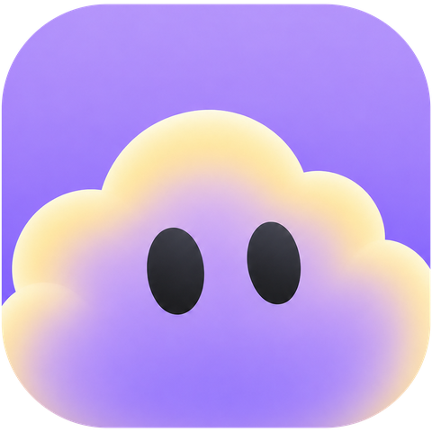

<div align="center">
  
  <h1>Solytiq Cloud — iOS</h1>
  <p><strong>A native SwiftUI task manager. Works fully offline, or connects to your self-hosted Solytiq Cloud server.</strong></p>
</div>

---

## What this is

A native iOS app (SwiftUI, iOS 17+) implementing the [Solytiq Cloud iOS UI kit](https://github.com) design — the mobile client for [skiptix/solytiq-cloud](https://github.com/skiptix/solytiq-cloud), a self-hosted "Luminous List" productivity suite.

The app has two independent modes, chosen on first launch (and switchable later from Settings):

| Mode | Storage | Account | Sync |
|---|---|---|---|
| **On This Phone** | SwiftData, on-device only | none | none — this device only |
| **Connect to Server** | your self-hosted instance, over REST | your Solytiq Cloud login | multi-device, real-time |

**On This Phone is a genuinely complete, 100%-local task manager on its own** — no account, no internet connection, no server required, ever. **Connect to Server** unlocks the multi-user features that only make sense with a backend: Files, the Sol AI assistant, Workspaces, sharing/public links, and account security (2FA, password management, member list). Switching modes does **not** migrate data between the two — they are two independent stores, and the app warns you before switching away from local data.

## Features

- **Today / Dashboard** — open/completed/due-today/this-week stats, quick add, today's focus list
- **Calendar** — month & week views, tasks + meetings + milestones on one calendar, drag-and-drop rescheduling
- **Lists** — folders, sections, tasks with priority/deadline/notes/subitems, sublists (a task can link to its own checklist)
- **Timelines** — milestone tracking with status (upcoming/in progress/done)
- **Trash** — 30-day recoverable soft-delete for tasks, lists, folders and timelines, in both modes
- **Settings** — profile, appearance (accent color / corner radius / density), and mode switching always available; **Files**, **Sol AI assistant**, **Workspaces**, **2FA**, and **Users** appear only once connected to a server
- Native SF Symbols, SwiftUI `NavigationStack`, SwiftData persistence, Keychain-backed auth token storage — no third-party dependencies

## Requirements

- Xcode 16 or later (the project uses Xcode 16's file-system-synchronized groups and Swift Testing)
- iOS 17.0+ deployment target
- To use Connect to Server: a running instance of [skiptix/solytiq-cloud](https://github.com/skiptix/solytiq-cloud)

## Getting started

```bash
git clone https://github.com/<you>/solytiq-cloud-mobile.git
cd solytiq-cloud-mobile
open SolytiqCloudMobile.xcodeproj
```

Pick a simulator or device and hit Run. No configuration, no API keys, no build scripts — **On This Phone** mode works immediately with zero setup.

To try server mode, point it at any reachable Solytiq Cloud instance (e.g. `http://192.168.1.20` on your LAN, or a public HTTPS domain) and sign in with your existing username/password. Self-signed / plain-HTTP LAN servers are allowed (`NSAllowsArbitraryLoads` is enabled in `Info.plist`) since this app is designed to talk to servers you run yourself.

## Architecture

```
SolytiqCloudMobile/
├── App/            AppState (mode/session), Router (navigation + sheet routing), app entry point
├── Theme/          Color tokens ported from colors_and_type.css, SF Symbol name mapping
├── Models/         SwiftData @Model types (local store) + plain domain structs the UI consumes
├── DTO/            Codable wire types matching the solytiq-cloud REST API responses
├── Networking/     APIClient (bearer-JWT REST client) + one file per resource (auth, tasks, lists, …)
├── Repositories/   DataStore — the single façade the UI calls; branches to SwiftData or REST per AppState.mode
├── Components/     Reusable views: TaskRow, Card, StatCard, QuickAddBar, the floating glass tab bar
├── Screens/        One folder per top-level screen
└── Sheets/         Every `.sheet` presentation (add/edit task, add list, settings, trash, AI chat, …)
```

**Key decision: a single `DataStore`, not per-mode view code.** Every screen calls the same `store.tasks()` / `store.createTask()` / etc. regardless of mode — `DataStore` is the only thing that knows whether it's reading SwiftData or calling the network. This is what makes "100% local, limited features" and "full server sync" the *same* codebase instead of two apps glued together.

**Auth:** the backend authenticates with a bearer JWT (`Authorization: Bearer <token>`), not cookies — ideal for a native client. The token and server URL live in the Keychain; nothing sensitive touches `UserDefaults`. On sign-in the app registers itself as a **device connection** on the server (sending its device name / model / OS), and the token is bound to that connection — so you can review and revoke this device from the web (**Account Settings → Mobile**), and an admin can allow or block the mobile app for the whole instance (**Settings → Mobile**). A revoked or blocked device is signed out on its next request and drops back to the mode picker.

**Local storage:** SwiftData models mirror the server's soft-delete design (`isTrashed` / `trashedAt` flags rather than hard deletes) so Trash/Restore behaves identically in both modes, including a 30-day auto-purge that runs at launch.

## What's intentionally not built

A handful of the backend's power-user/admin features aren't in the iOS prototype this app implements, and aren't in this build either: GPS track upload/routing, CalDAV server management, the Admin API/key management, and MCP server configuration. These remain web-admin-panel features — Settings says as much ("More settings are available in the web interface of your self-hosted instance").

## Regenerating design tokens / app icon

```bash
python3 tools/generate_colors.py   # regenerates Assets.xcassets/*.colorset from the token table in the script
```

The Xcode project uses Xcode 16's **file-system-synchronized groups** — any `.swift` file you add under `SolytiqCloudMobile/` or `SolytiqCloudMobileTests/` is picked up automatically the next time you open the project; there's no `project.pbxproj` file list to hand-edit.

## License

MIT — see [LICENSE](LICENSE).
